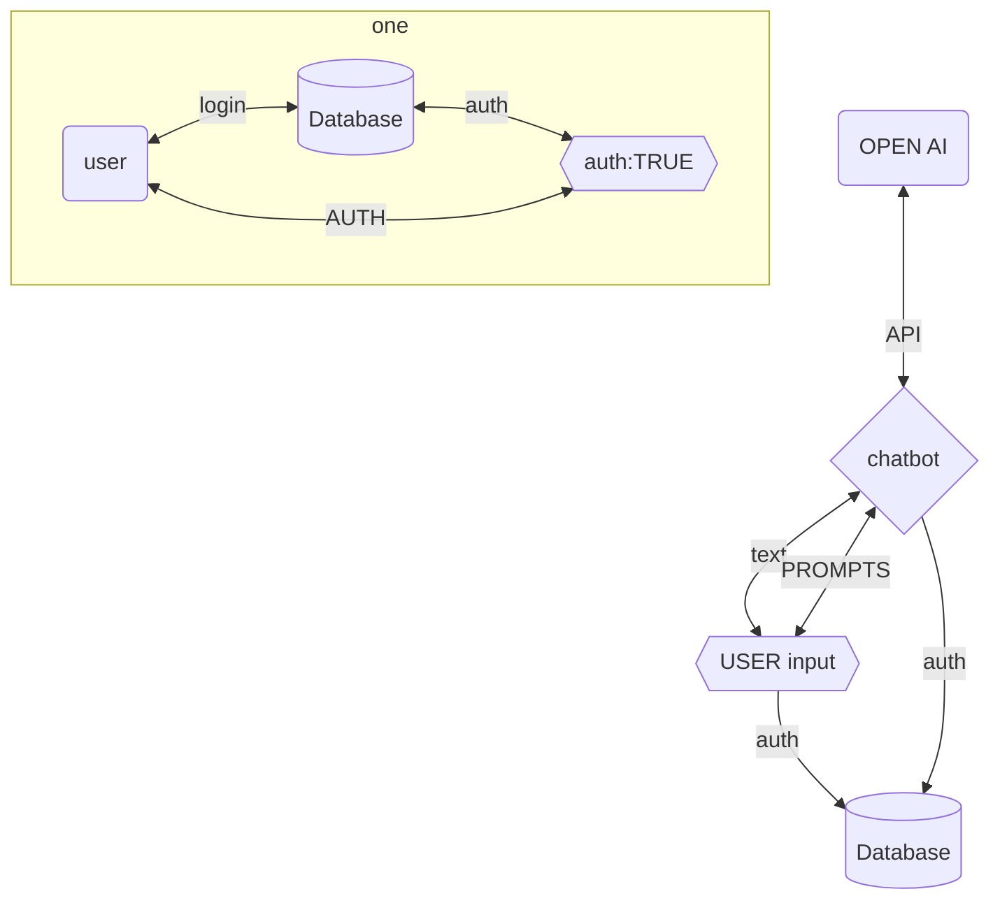

# chatbot_uml

```mermaid
flowchart TB
     A(OPEN AI) <-- API --> B{chatbot} <-- text --> C{{USER input }}
     B <-- PROMPTS --> C
     C --auth--> D[(Database)]
     B -- auth --> D
     subgraph one
     A1(user) <-- login --> D1[(Database)] <-- auth --> C1{{ auth:TRUE }}
     A1  <-- AUTH --> C1
     end
  
    


```
