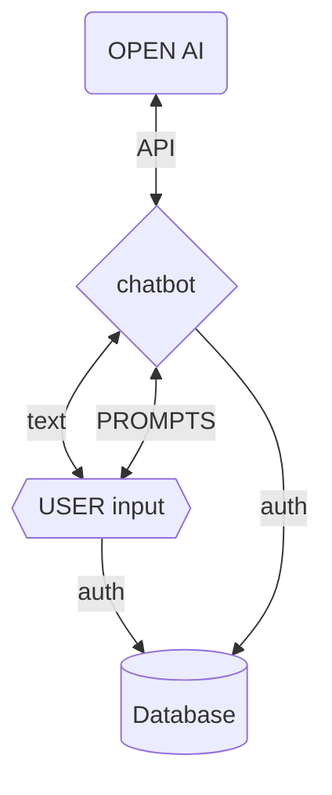

# chatbot_uml

```mermaid
flowchart TB
     A(OPEN AI) <-- API --> B{chatbot} <-- text --> C{{USER input }}
     B <-- PROMPTS --> C
     C --auth--> D[(Database)]
     B -- auth --> D
    


```

```mermaid
flowchart LR
     A(user) <-- login --> D[(Database)] <-- auth --> C{{ auth:TRUE }}
     A  <--AUTH-> C 
  
    


```
