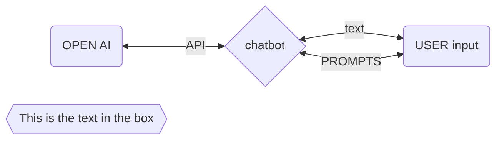

# chatbot_uml

```mermaid
flowchart LR
     A(OPEN AI) <-- API --> B{chatbot} <-- text --> C(USER input )
     B <-- PROMPTS --> C
      id1[(Database)]
     id1{{This is the text in the box}}


```
